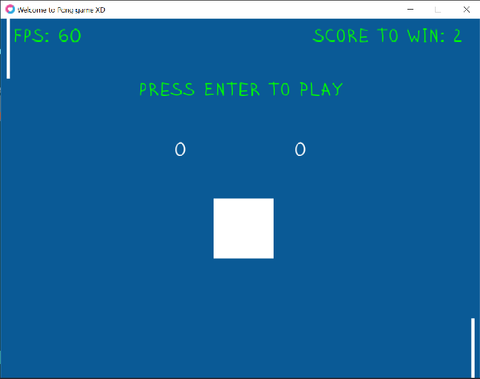

## Welcome to Pong




> [!NOTE] 
> The game is wrote in Lua, using framework LOVE2d

## How to Install

- Open terminal then copy
``` git
git clone https://github.com/KinhKhaVN/GraphicProgramming/tree/master/LuaGame2D/Pong.git
```
- If you have Make then just Make ***(but you need to install LOVE2d first)***, otherwise go to file **/build/bin/Pong.exe**
- Use **space** to **play** or **pause** game
- Player1 use **W** to move up and **S** to move down
- Player2 use **up arrow key** to move up and **down arrow key** to move down

> [!IMPORTANT]
> Each time ball hit Player, it will move faster

Have fun!!!
